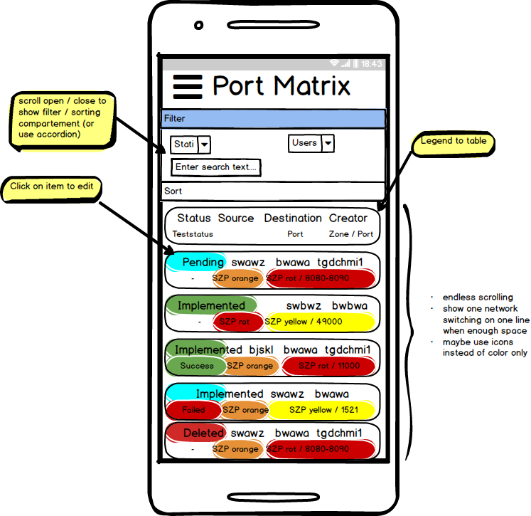
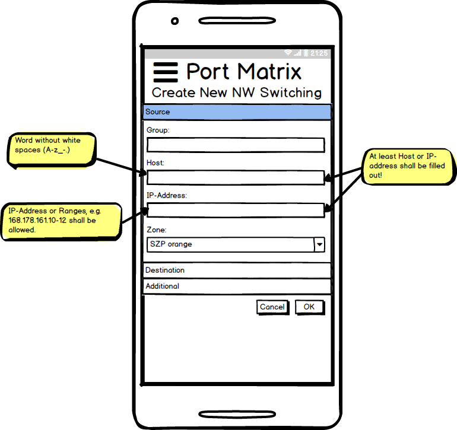
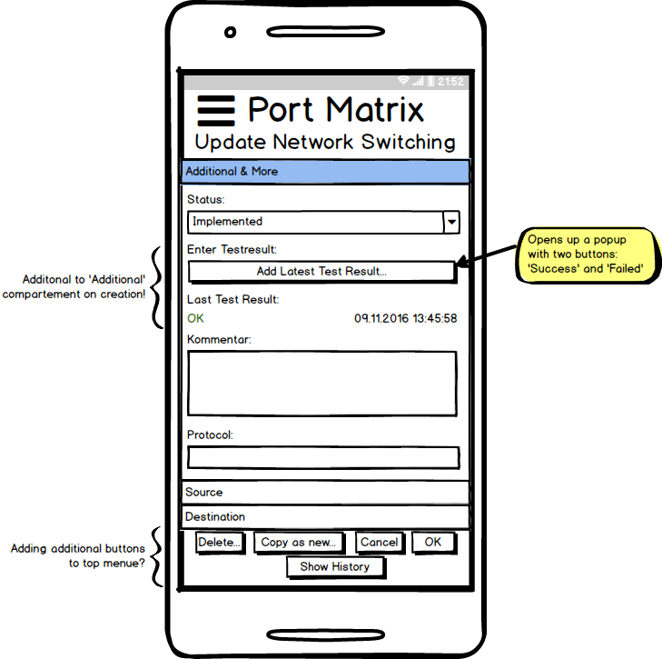

# Specification

## Introduction
The PortMatrix is an application used by multiple users sharing a common network infrastructure. Within this network
infrastructure divided into different zones countless firewall rules need be applied and managed. The tool here shall
save up these settings and represent the current state.

Since a network infrastructure is shared within a community / company every firewall rule shall be visible among all
members. Thus it is not advised to split up a network infrastructure into smaller units. For the PortMatrix tool this
means that a user cannot take part in different network infrastructures, technically spoken 'projects'.

## Glossary
<dl>
  <dt>Network Switching</dt>
  <dd>A network switching is the main thing we manage in this application. Normally a network switching is a firewall
      rule. A network switching is defined by a source network address (or its IP-address), its destination network
      address (or its IP-address) and a protocol (typically TCP or UDP)</dd>
  <dt>Project</dt>
  <dd>A network infrastructure with all its network rules is represented as one project.</dd>
</dl>

## General
A user can take part in one project only.

The user interface shall be implemented in English only.

A network switching shall be defined only once. A network switching is defined by:
* source (defined by hostname or IP address)
* destination (defined by hostname or IP address)
* a protocol (typically TCP or UDP)

## User Management
The PortMatrix application is a multi user tool. A user can register itself and invite further colleagues to his project.
The invited colleagues have to register itself before be able to use the project.
_Prio 2:_ Unregistered users are able to immediately see the project (read-only).

A user is represented by an email and his password.

Currently it is foreseen to have one type of user only. This means invited (and registered) users have the same rights
as the project creator.

## Use Cases

* User registers himself
* Manage network state
* Manage network zones
* Invite colleagues
* enter network rules
* edit network rules
* delete network rules
* show history of a network rule
* enter a test result of a network rule
* browse, filter and sort network rules
* search for network rules

_Prio2:_
* User has password forgotten
* Manage a cache for learning which host is placed within which zone: Suggest zone according entered host name / IP
address.
* Lookup IP-address / hostname according entered hostname / IP-address.

_Prio3:_
* Import / Export to / from CSV
* use WebSockets and propagate changes to opened clients immediately (without page reload)

## User Interface Mockups

### Mobile

#### Searching/Filtering View

In the menu (3 horizontal bars) following commands can be called:

* Manage network zones
* Manage network switching states
* Invite colleagues
* Logout

Sorting shall be possible by:

* creation date
* by status
* by group or zone (ignoring if source or destination)

Filtering shall be possible by:

* user (the creator; multiple shall be possible)
* state (multiple shall be possible)

As a simplification we could realize a search field: Seek entered words in all fields of all records...

#### Create Network Switching

When opening 'Destination' we have following fields:
Same as Source but additionally:

* Port(s): String

And on opening 'Additional' we have:

* ID: User can use this field for unique identification. If filled out, it must be unique.
* Status: Combobox with defined values, default value is first element
* Protocol: String
* Comment: Multi-Line-String

#### Update Network Switching

When clicking 'Show History' a new page is presented with:

* ID, source, destination and protocol
* a table showing:
  * 3 columns: Date (e.g. '23.11.2016 21:45:30' (or similar)), User, Event
  * following events shall be contained:
    * creation
    * state changes
    * test results
    * _optionally:_ changes on other fields (commentary, source, destination, protocol): save old value
* a 'close' button

